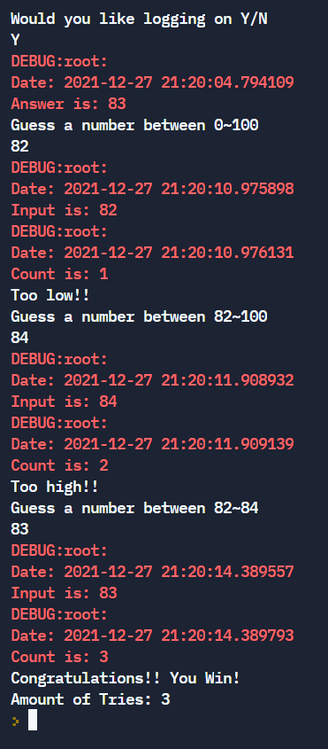

### Number Guesser - Mini Project
A Python application that implements the Number Guesser game.
This game generates a random number for the user to guess.

December 27 2021

Trainer: 
- Bharath Kumar Nagaraj

Team Members:
- Michael Hayes @mhh916
- Theodore Hartin @theehartin
- Nathanael Mottonen @mottonen12n
- Zachery Brinner @ZacheryZan

### Technologies
- Python
- Unit Testing
- Pylint

### Modules
- logging
- random
- re
- datetime

### Sample Output

